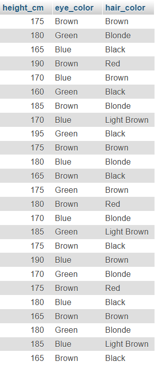
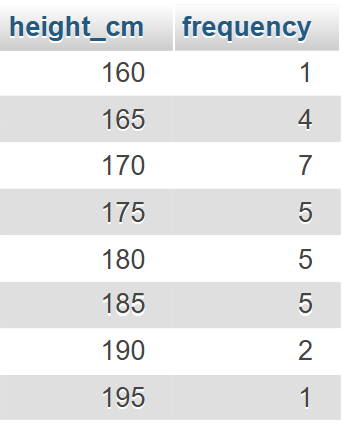
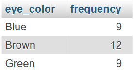
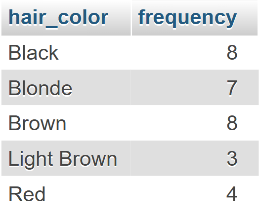
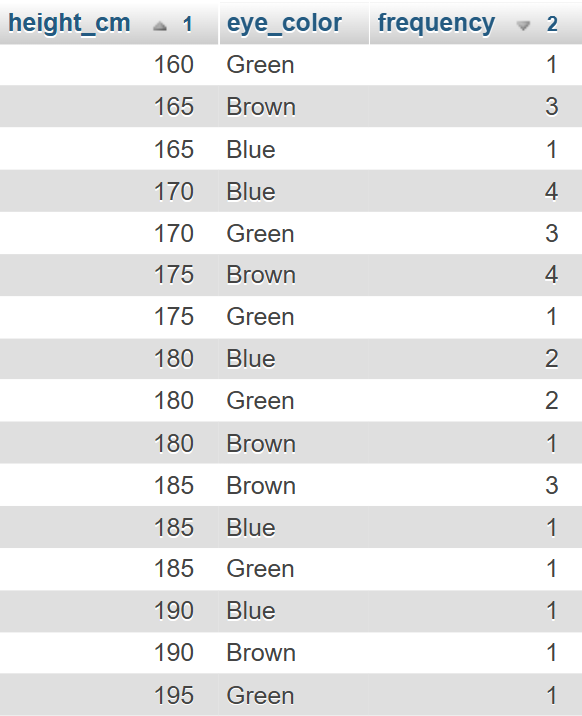
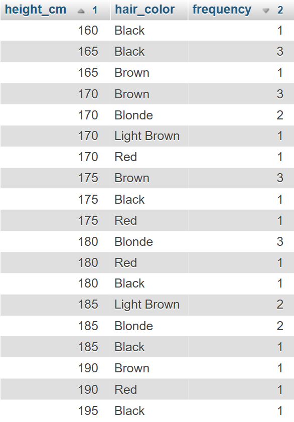
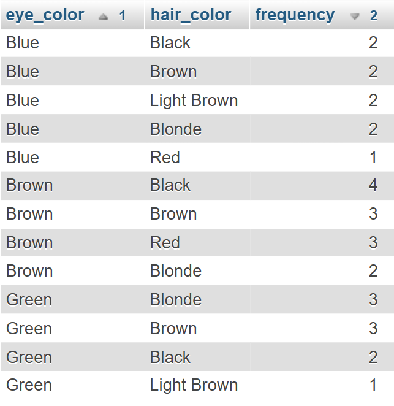

# 📝 Homework #02
---

## Explain the concept of **dataset** and **distribution**

---

### Dataset
A dataset is a matrix in which:
- The rows are the **statistical units**: the things we want to study.
- The columns are their **variables**: the attributes of the statistical units we interested in, operationalized in some way.

### Distribution
A distribution rapresent the way in which a certain variable manifests itselfe in a dataset

In **Descriptive Statistics** a distribution rapresents the *frequency* in which diffents values of a variable manifest themselfe in a dataset. A distribution can be univariate, concerning just one attribute, bivariate, considering two variables, or multivariate.

In **Inferential Satistics** a distribution rapresents all the possible values a certain variable can assume with the probability that value accours. It is a mathematical model binding a specific probability for each possible value.

<br><br>

---

## Using a DBMS create a simple dataset. Compute the univariate distribution.
### 🏆*For champions: compute a bivariate distribution*

---

Using MariaDB I've created a simple dataset containing the heights, the eye color and hair color of a group of people:



### Univariate Distributions
The following tables show the univariate distribution for each variable.
These distributions were obtained running the following SQL queries:

```sql
SELECT 
	<attribute>, 
	COUNT(<attribute>) AS frequency 
FROM 
	`homework-01` 
GROUP BY 
	<attribute>
```

  

### Bivariate Distributions
The following tables show the bivariate distribution for each couple of variables.
These distributions were obtained running the following SQL queries:

```sql
SELECT
    <attribute1>,
    <attribute2>,
    COUNT(*) AS frequency
FROM
    `homework-01`
GROUP BY
    <attribute1>,
    <attribute2>
ORDER BY
    <attribute1> ASC, frequency DESC
  ```

  

<h1>Ceasar Cipher Decryption Through Frequency Analysis</h1>

<h2>Insert plaintext to decrypt</h2>

<textarea id="plaintextInput" rows="8" maxlength="5000" 
	placeholder="Paste the ciphertext here. Frequency analysis will automatically detect the language and key (rotation)."
</textarea>


